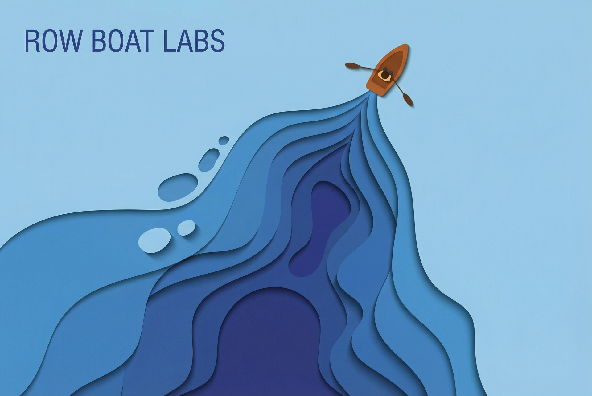

<p align="center">
  
</p>

<h1 align="center">🚣 Row Boat Labs</h1>

<p align="center">
  <strong>Your AI coworker that remembers everything.</strong><br/>
  Connect your workspace. Build a living knowledge graph. Let AI act on your memory — not its hallucinations.
</p>

<p align="center">
  <a href="#features">Features</a> •
  <a href="#architecture">Architecture</a> •
  <a href="#getting-started">Getting Started</a> •
  <a href="#data-model">Data Model</a> •
  <a href="#design-system">Design System</a> •
  <a href="#roadmap">Roadmap</a> •
  <a href="#license">License</a>
</p>

---

## Overview

Row Boat Labs is a production-grade AI workspace assistant that ingests your emails, calendar events, and documents, builds a persistent **knowledge graph** stored as plain Markdown with backlinks (Obsidian-compatible), and provides an AI coworker chat grounded in *your* real context — not hallucinations.

Built on top of the open-source [Rowboat](https://github.com/rowboatlabs/rowboat) framework (Apache-2.0), rebranded and extended with a bespoke "abstract papercut topography" UI.

---

## Features

### 🔐 Authentication & User Isolation
- Secure email/password authentication via Lovable Cloud
- Each user has fully isolated vault, integrations, and data

### 📬 Real Integrations (Google Workspace)
- **Gmail** — read-only ingestion of emails with entity extraction
- **Google Calendar** — event sync with meeting brief generation
- **Google Drive** — metadata and optional document ingestion
- Real OAuth 2.0 flow with secure token storage and refresh
- Incremental cursor-based sync with visible sync logs

### 📝 Markdown Vault
- Local-first knowledge vault stored as plain Markdown
- `[[Backlinks]]` automatically extracted and maintained
- File-tree navigation with inline editor
- Obsidian-compatible format — export and edit anywhere

### 🕸️ Knowledge Graph
- Interactive canvas-based graph visualization
- Nodes represent notes; edges represent backlinks
- Click-through navigation from graph to note editor
- Filter and search across entities, people, projects, and topics

### 🤖 AI Coworker Chat
- Conversational interface grounded in your knowledge graph
- Context-aware: pulls relevant notes, recent emails, and meetings
- Generates real artifacts:
  - Meeting prep docs
  - Project briefs
  - Deck outlines
  - Exportable PDF files (real generation, real downloads)

### 📊 Inbox & Meetings
- Gmail sync status dashboard with ingested email list
- "Extract to memory" actions on individual items
- Calendar event list with action items and follow-ups
- Meeting briefs auto-generated from ingested context

### ⚙️ Settings & Extensibility
- Google OAuth connect/disconnect with scope status
- API key management (OpenAI, Deepgram, Brave, Exa)
- All secrets stored securely — never in client code
- Tools registry foundation for future MCP server integrations

---

## Architecture

```
┌──────────────────────────────────────────────────┐
│                   Frontend (React)                │
│  Vite · TypeScript · Tailwind CSS · shadcn/ui    │
│  Framer Motion · React Router · TanStack Query   │
├──────────────────────────────────────────────────┤
│                  Lovable Cloud                    │
│  ┌────────────┐  ┌──────────┐  ┌──────────────┐ │
│  │    Auth     │  │ Database │  │   Storage    │ │
│  │  (Supabase) │  │ (Postgres)│  │  (S3-compat)│ │
│  └────────────┘  └──────────┘  └──────────────┘ │
│  ┌────────────────────────────────────────────┐  │
│  │         Edge Functions (Deno)              │  │
│  │  • Google OAuth  • Sync Pipeline           │  │
│  │  • AI Chat       • Artifact Generation     │  │
│  └────────────────────────────────────────────┘  │
└──────────────────────────────────────────────────┘
```

### Tech Stack

| Layer | Technology |
|-------|-----------|
| **Frontend** | React 18, TypeScript, Vite |
| **Styling** | Tailwind CSS, shadcn/ui, CSS custom properties |
| **Animation** | Framer Motion (parallax, hover lift, paper flex) |
| **State** | TanStack React Query, React Context |
| **Routing** | React Router v6 (nested layouts) |
| **Backend** | Lovable Cloud (Supabase under the hood) |
| **Database** | PostgreSQL with Row Level Security |
| **Auth** | Email/password with session management |
| **AI** | Lovable AI Gateway (Gemini, GPT-5, and more) |

---

## Getting Started

### Prerequisites

- Node.js 18+ and npm (or [bun](https://bun.sh))
- A [Lovable](https://lovable.dev) account (for Cloud backend)

### Local Development

```bash
# Clone the repository
git clone <YOUR_GIT_URL>
cd <YOUR_PROJECT_NAME>

# Install dependencies
npm install

# Start the dev server
npm run dev
```

The app will be available at `http://localhost:5173`.

### Google Integration Setup

To enable real Gmail, Calendar, and Drive sync:

1. Go to [Google Cloud Console](https://console.cloud.google.com/)
2. Create a new project or select an existing one
3. Enable the following APIs:
   - Gmail API
   - Google Calendar API
   - Google Drive API
4. Configure the OAuth consent screen (External, add test users)
5. Create OAuth 2.0 credentials (Web application)
6. Add authorized redirect URIs for your deployment
7. Enter your Client ID and Client Secret in **Settings → Integrations**

> Detailed setup instructions are also available in-app at `/app/settings`.

---

## Data Model

| Table | Purpose |
|-------|---------|
| `profiles` | User display names and avatars |
| `integrations` | OAuth tokens, provider status, scopes |
| `sources` | Raw ingested items (email IDs, event IDs, file IDs) |
| `notes` | Markdown vault — path, content, backlinks |
| `entities` | Extracted people, projects, topics, decisions |
| `artifacts` | Generated documents (briefs, decks, PDFs) |
| `sync_runs` | Sync job logs with status, timing, and errors |

All tables are protected by **Row Level Security** — users can only access their own data.

---

## Design System

### Visual Language

Row Boat Labs uses an **"abstract papercut topography"** design language:

- **Layered shapes** with realistic cut edges and ambient occlusion shadows
- **Parallax** on pointer movement for physical depth feel
- **Grain overlay** to prevent flat, sterile gradients
- **Paper shadow** system with hover-lift micro-interactions

### Color Palette

| Token | Description | HSL |
|-------|-------------|-----|
| `--ocean-lightest` | Lightest blue | `207 45% 82%` |
| `--ocean-light` | Light blue | `210 50% 68%` |
| `--ocean-mid` | Mid blue | `215 55% 52%` |
| `--ocean-deep` | Deep blue | `218 60% 38%` |
| `--ocean-abyss` | Darkest blue | `220 65% 20%` |
| `--navy` | Core navy | `215 50% 12%` |
| `--boat-orange` | Primary CTA | `24 60% 52%` |

### Key Components

- **`PaperLayer`** — Reusable parallax depth layer with SVG path support, shadow, and hover lift
- **`WaveBackground`** — Layered wave composition using multiple PaperLayers
- **`GrainOverlay`** — Subtle noise texture applied globally

### Typography

Clean geometric sans-serif with generous whitespace. Large airy headings paired with refined body text.

---

## Project Structure

```
src/
├── assets/              # Static assets (hero image)
├── components/
│   ├── ui/              # shadcn/ui primitives
│   ├── AppSidebar.tsx   # App navigation sidebar
│   ├── GrainOverlay.tsx # Global grain texture
│   ├── PaperLayer.tsx   # Parallax depth component
│   └── WaveBackground.tsx
├── hooks/
│   ├── useAuth.tsx      # Auth context & provider
│   └── use-mobile.tsx   # Responsive breakpoint hook
├── integrations/
│   └── supabase/        # Auto-generated client & types
├── layouts/
│   └── AppLayout.tsx    # Authenticated app shell
├── pages/
│   ├── Index.tsx        # Landing page
│   ├── Auth.tsx         # Sign in / Sign up
│   ├── NotFound.tsx     # 404
│   └── app/
│       ├── Chat.tsx     # AI coworker chat
│       ├── Vault.tsx    # Markdown vault & editor
│       ├── Graph.tsx    # Knowledge graph visualization
│       ├── InboxPage.tsx # Email inbox & sync
│       ├── Meetings.tsx  # Calendar & meetings
│       └── SettingsPage.tsx # Integrations & keys
└── lib/
    └── utils.ts         # Tailwind merge utility
```

---

## Roadmap

- [x] Landing page with papercut design system
- [x] User authentication (email/password)
- [x] Markdown vault with backlinks
- [x] Knowledge graph visualization
- [x] App shell with sidebar navigation
- [ ] Google OAuth edge function (real token exchange)
- [ ] Gmail/Calendar incremental sync pipeline
- [ ] AI coworker chat with knowledge graph RAG
- [ ] Real PDF artifact generation & download
- [ ] MCP tools registry & extensibility
- [ ] Drive document ingestion
- [ ] Deepgram/Brave/Exa tool integrations

---

## License

This project is built on top of [Rowboat](https://github.com/rowboatlabs/rowboat), licensed under the **Apache License 2.0**.

Row Boat Labs branding, design system, and extended features are proprietary. The underlying Rowboat framework components retain their original Apache-2.0 license. See [LICENSE](LICENSE) for details.

---

<p align="center">
  <sub>Built with ❤️ by Row Boat Labs · Powered by <a href="https://lovable.dev">Lovable</a></sub>
</p>
